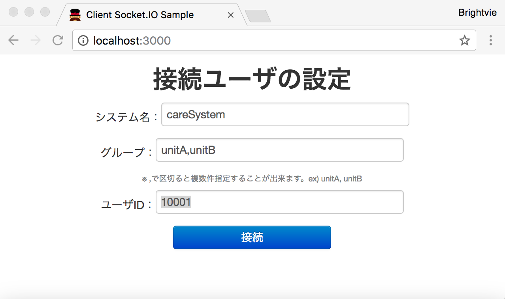
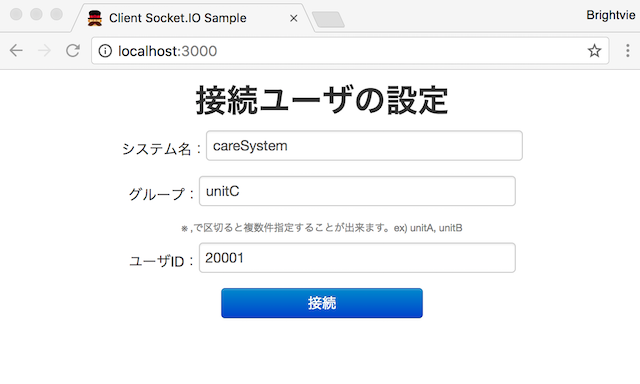
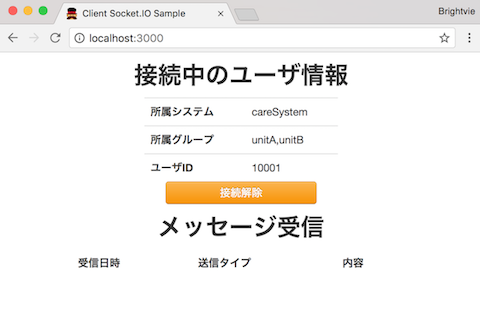
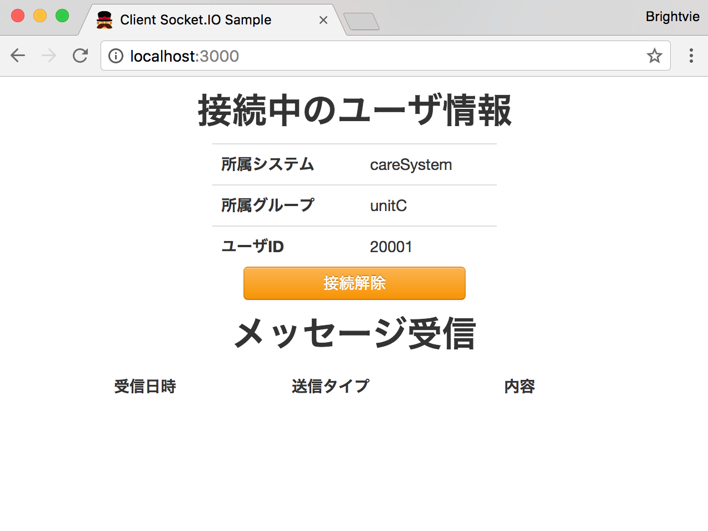

# WebSocket Notification Library を利用したデモ

これは、BRIGHT VIEで利用している「webSocketNotification」ライブラリを利用したアプリケーションのデモです。


## 機能紹介

### ユーザページ

* ユーザの設定画面
   * ここでは、「所属するシステム名」「所属するグループ（複数）」「ユーザID」を入力することで、WebSocketサーバに対してユーザ属性の登録を行う。
   * ここでユーザ情報を登録しておくことにより、既存のWebアプリケーション側で管理しているユーザ単位でWebSocketを利用した通知などが行えるため、WebSocket側のユーザ管理方法を気にしなくても利用できるメリットがある。

TODO: ここに画像を貼る





* 通知受信画面
   * ここでは、「管理ページ」より通知が行われた際に、受信したメッセージを表示する画面である。
   * このライブラリでは、大きく４パターンの通知方法が可能であり、「全体通知(all)」「所属システム通知(system)」「所属グループ通知(group)」「ユーザ通知(user)」で分類している。





### 管理ページ

* 通知送信画面
   * ここでは、接続しているユーザの一覧とそのユーザに対してWebSocketを経由して通知を送る画面である。
   * 送信先の指定を4つのカテゴリから選択し、選択したカテゴリに属するユーザに対してWebSocketから通知を送ることが可能である。
   * 接続しているユーザの情報はリアルタイムに反映される。


## 動作環境

- macOS Sierra (10.12.5)
- node v6.11.0
- npm v3.10.10


## 環境構築

### 1. Node.jsのインストール

- nvm をインストールする
   Nodejsのバージョン管理ツールである、nvmをインストールする

   ```
   git clone git://github.com/creationix/nvm.git ~/.nvm
   ```

- ホームディレクトリの.bash_profileにnvmの読み込み設定を記載する

   ```
   if [[ -s ~/.nvm/nvm.sh ]] ; then source ~/.nvm/nvm.sh ; fi
   ```

- Node.js v6.11.0をインストール

   ```
   nvm install v6.11.0
   ```

- インストールされたバージョンを確認

   ```
   node -v
   ```

### 2. bowerによりWebのフロントエンドで利用するライブラリのインストール

- bowerコマンドのインストール

   ```
   npm install -g bower
   ```

- bower コマンドを利用して、bower.jsonに記載されているライブラリをインストールする

   ```
   bower install
   ```

- .bowerrcに記載されたdirectoryがインストール先となるため、インストールされているか確認する

   ```
   ls -l public/components
   ```

### 3. npmにより、サーバサイドで利用するライブラリのインストール

- npm コマンドを利用して、package.jsonに記載されているライブラリをインストールする

   ```
   npm install
   ```

- npmでインストールされたライブラリは、node_modules以下にインストールされる

   ```
   ls -l node_modules
   ```

### 4. サーバを起動

- Node.jsでサーバを起動する

   ```
   node server.js
   ```
   http://localhost:3000 でサーバにアクセスすることが出来る 


### 5. ブラウザを起動して確認

- ユーザページ
   - http://localhost:3000/index.html

- 管理ページ
   - http://localhost:3000/admin.html


